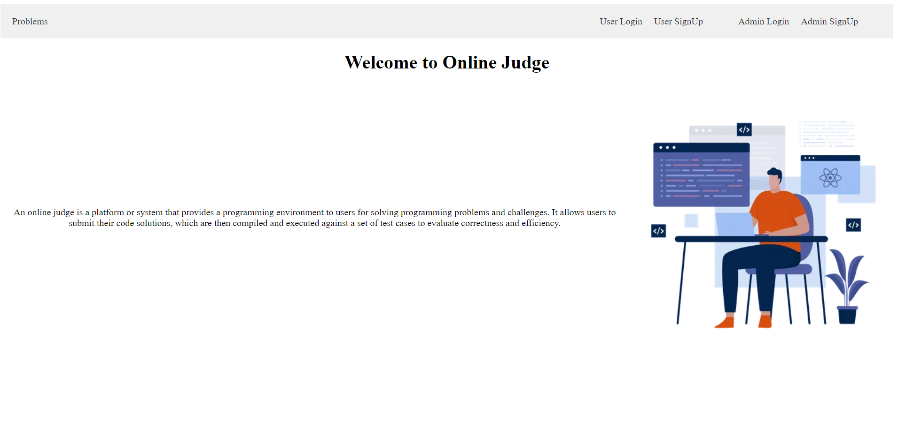

Online-Judge | Online-Coding-Platform (MERN based Website)

An online judge is a platform or system that provides a programming environment to users for solving programming problems and challenges. It allows users to submit their code solutions, which are then compiled and executed against a set of test cases to evaluate correctness and efficiency.

Build a platform that runs and compiles user submitted code for a programming problem securely and judges if the code is correct/wrong.

Run Online-Judge Locally

•	Navigate to Client directory and install all the dependencies for the client side using command : npm install and run using command : npm run dev to run vite on PORT 5173.

•	Navigate to Server directory and install all the dependencies for the server side using command: npm install.

•	To use MongoDB-atlas create a .env file and defined a key named MONGO_URI and its value will be your atlas URL.

•	Server uses cookies to handle authentication, which uses JWT_SECRET which is also defined in .env file with key named SECRET_KEY.

•	To run the server using command: npm start. The server will start on PORT 5000.

•	Navigate to Compiler directory and install all the dependencies for the compiler using command: npm install and run using command: npm start. The compiler will start on PORT 4000.
